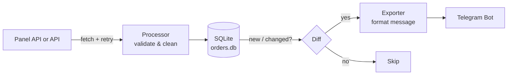

<div align="center">

# 📦 Order Automation

**پایش خودکار سفارش‌ها، اعتبارسنجی داده و اطلاع‌رسانی لحظه‌ای در تلگرام**


معرفی • 
امکانات • 
نصب • 
تنظیمات • 
اجرا • 
ساختار پروژه • 
عیب‌یابی

</div>

---

<div dir="rtl">

## 📖 معرفی

سیستمی برای پایش خودکار سفارش‌های یک پنل فروش، پردازش و اعتبارسنجی آن‌ها و ارسال نوتیفیکیشن به تلگرام برای سفارش‌های **جدید** یا **تغییریافته**.

این پروژه به‌صورت دوره‌ای (یا با اجرای دستی) به پنل متصل می‌شود، لیست سفارش‌ها را دریافت می‌کند، آن‌ها را اعتبارسنجی و تمیز می‌کند، وضعیت‌شان را در یک دیتابیس محلی SQLite ذخیره می‌کند و در صورت جدید یا تغییریافته بودن، یک پیام به تلگرام ارسال می‌کند.

## ✨ امکانات

| | قابلیت | توضیح |
|---|---|---|
| 🔌 | دریافت سفارش‌ها | اتصال به API پنل و دریافت لیست سفارش‌ها |
| 🧹 | اعتبارسنجی و تمیزسازی | تبدیل داده خام به ساختار تمیز و استاندارد |
| 🔍 | تشخیص تغییر | شناسایی سفارش‌های جدید یا تغییریافته، بدون نوتیفیکیشن تکراری |
| 💬 | نوتیفیکیشن تلگرام | ارسال پیام خوانا برای هر سفارش جدید یا تغییریافته |
| 🔁 | Retry خودکار | تلاش مجدد برای خطاهای شبکه و سرور |
| 📝 | لاگ‌گیری کامل | مناسب اجرای بدون نظارت |

## 🔄 نحوه کار

</div>



<div dir="rtl">

## 🧰 پیش‌نیازها

* Python **3.11** یا بالاتر
* یک ربات تلگرام (دریافت توکن از [@BotFather](https://t.me/BotFather))
* دسترسی به API پنل

## 🚀 نصب و راه‌اندازی

</div>

```bash
git clone <repository-url>
cd order_automation

python -m venv venv
source venv/bin/activate      # ویندوز: venv\Scripts\activate

pip install -r requirements.txt
```

<div dir="rtl">

## ⚙️ تنظیمات

فایل `.env.example` را کپی کن و مقادیر را پر کن:

</div>

```bash
cp .env.example .env
```

<div dir="rtl">

### متغیرهای محیطی (Environment Variables)

| متغیر | توضیح | اجباری |
| :--- | :--- | :--- |
| `BASE_URL` | آدرس پایه سرور API، بدون مسیر endpoint | ✅ بله |
| `PANEL_URL` | آدرس پنل | در صورت استفاده |
| `PANEL_USERNAME` | نام کاربری پنل | در صورت نیاز به auth |
| `PANEL_PASSWORD` | رمز عبور پنل | در صورت نیاز به auth |
| `BOT_TOKEN` | توکن ربات تلگرام | ✅ بله |
| `CHAT_ID` | شناسه چت تلگرام برای ارسال پیام | ✅ بله |
| `LOG_LEVEL` | سطح لاگ‌گیری (`INFO`, `DEBUG`, ...) | خیر (پیش‌فرض: `INFO`) |

> [!WARNING]
> فایل `.env` شامل اطلاعات حساس (توکن و رمز عبور) است. آن را **هرگز** در مخزن commit نکن و مطمئن شو در `.gitignore` قرار دارد.

## ▶️ اجرا

</div>

```bash
python main.py
```

<div dir="rtl">

خروجی موفق باید چیزی شبیه این باشد:

</div>

```text
INFO     Starting application
INFO     Fetching orders from panel
INFO     Processed 10 valid orders out of 10
INFO     2 orders are new or changed
INFO     Notification sent to Telegram chat ...
INFO     Application finished successfully
```

<div dir="rtl">

## 🧪 تست و کیفیت کد

</div>

```bash
# اجرای تست‌های واحد
pytest

# بررسی و فرمت‌کردن کد
ruff check .
ruff format .
```

<div dir="rtl">

## 🗂 ساختار پروژه

</div>

```text
order_automation/
├── app/
│   ├── api.py              # ارتباط با API پنل (با retry)
│   ├── config.py           # خواندن تنظیمات از .env
│   ├── database.py         # ذخیره‌سازی وضعیت سفارش‌ها (SQLite)
│   ├── exporter.py         # تبدیل سفارش به متن خوانا
│   ├── logger.py           # تنظیمات لاگ‌گیری
│   ├── notifications/      # کانال‌های نوتیفیکیشن (تلگرام و...)
│   └── processor.py        # اعتبارسنجی و تمیزسازی داده
├── tests/                  # تست‌های واحد
├── data/                   # دیتابیس SQLite نمونه (داده تستی، بدون اطلاعات حساس)
├── main.py                 # نقطه ورود برنامه
└── requirements.txt
```

<div dir="rtl">

## 🛠 عیب‌یابی

<details>
<summary><b>پیامی به تلگرام نمی‌رسد</b></summary>

* مطمئن شو قبلاً به ربات پیام داده‌ای (ربات نمی‌تواند اول پیام بدهد).
* `BOT_TOKEN` و `CHAT_ID` را در `.env` بررسی کن.

</details>

<details>
<summary><b>برنامه همه سفارش‌ها را دوباره نوتیفای می‌کند</b></summary>

* فایل `data/orders.db` را چک کن؛ اگر پاک شده باشد، تاریخچه از دست رفته است.

</details>

<details>
<summary><b>خطای اتصال به پنل</b></summary>

* `PANEL_URL` را بررسی کن.
* لاگ‌ها را برای جزئیات خطای retry ببین.

</details>

</div>
